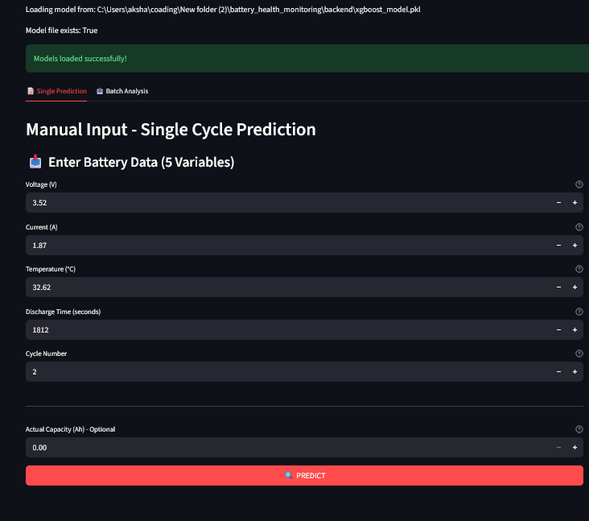

# Battery Health Monitoring System 🔋

## 🎯 Project Overview

A **production-ready** battery health monitoring system that combines machine learning with real-time anomaly detection. This full-stack application uses the **XGBoost degradation model (88% accuracy)** to predict battery capacity, detect anomalies, and estimate State of Health (SOH).

**Key Features:**
- ⚡ **Real-time anomaly detection** using residual-based thresholding
- 📊 **State of Health (SOH) estimation** with degradation rate tracking
- 🎨 **Interactive Streamlit dashboard** for visualization
- 🔧 **Automatic feature engineering** from 5 basic inputs to 18 features
- 📈 **Batch analysis** for processing multiple cycles
- 🚨 **Multi-level alerts**: Normal → Warning → Anomaly → Critical

---

## 🏗️ System Architecture

---

## 🔄 How It Works

### Step 1: User Provides 5 Basic Variables

Users provide **only 5 measurements**:
```python
1. Voltage (V)          → Terminal voltage
2. Current (A)          → Discharge current
3. Temperature (°C)     → Battery temperature
4. Discharge Time (s)   → Total discharge duration
5. Cycle Number         → Current cycle count
```

**Optional:**
- Actual Capacity (Ah) → For anomaly detection

**Why only 5 inputs?**
- ✅ **Easy to collect** - Standard battery management system (BMS) sensors
- ✅ **Real-world practical** - Available in production systems
- ✅ **No ML expertise needed** - Simple measurements anyone can provide

---

### Step 2: Automatic Feature Engineering

The system **automatically generates 18 features** from those 5 inputs:

```python
# Feature Engineering Pipeline
BatteryFeatureEngineer.process_manual_input()
    ↓
Generates 18 Features:
  • Voltage_measured, Current_measured, Temperature_measured
  • cycle_normalized, cycles_from_start
  • capacity_velocity, capacity_acceleration
  • voltage_rolling_mean_5, temp_rolling_mean_5
  • capacity_trend_5
  • voltage_change, resistance_proxy
  • internal_resistance, power_avg
  • voltage_efficiency, temp_capacity_interaction
  • degradation_acceleration_abs
  • estimated_cycles_to_eol
```

**Why Automatic Feature Engineering?**
- ✅ **User-friendly**: No ML knowledge required
- ✅ **Consistent**: Same features as training data
- ✅ **No data leakage**: Only uses available information
- ✅ **Production-ready**: Real-time computation (<5ms)
- ✅ **Physics-based**: Includes domain knowledge (resistance, efficiency, etc.)

---

### Step 3: Capacity Prediction with XGBoost



*Figure 1: Complete system architecture - From raw inputs to anomaly detection*


*Figure 2: Prediction output showing predicted capacity and model metrics*

**XGBoost Model:**
- **Training**: 3 batteries (B0005, B0006, B0007)
- **Accuracy**: **R² = 0.884 (88.4%)**
- **Error**: **MAPE = 2.90% (<3%)**
- **Features**: 18 engineered features
- **Test Battery**: B0018 (completely unseen)

```python
# Prediction Process
predicted_capacity = xgboost_model.predict(features_18)
# Output Example: 1.650 Ah
```

**Prediction Flow:**
```
18 Features → XGBoost Model → Predicted Capacity (Ah)
```

---

### Step 4: Anomaly Detection with SOH Batch Processing


*Figure 3: Anomaly detection interface showing status, severity, and thresholds*


*Figure 4: Batch analysis with anomaly detection timeline and SOH degradation curve*

**Residual-Based Anomaly Detection:**

```python
Residual = |Actual Capacity - Predicted Capacity|

if Residual < 0.07 Ah:
    Status = "NORMAL" ✅
    Severity = "Low"
    
elif Residual < 0.10 Ah:
    Status = "WARNING" ⚠️
    Severity = "Medium"
    
elif Residual < 0.15 Ah:
    Status = "ANOMALY" 🔶
    Severity = "High"
    
else:
    Status = "CRITICAL" 🚨
    Severity = "Critical"
```

**Threshold Calculation:**
```python
# Based on training data residuals
threshold_normal = mean_residual + 2σ  # ~0.07 Ah
threshold_warning = mean_residual + 3σ  # ~0.10 Ah
threshold_critical = mean_residual + 4σ # ~0.15 Ah
```

**From training data:**
- Mean residual: 0.03 Ah
- Standard deviation: 0.02 Ah

---

### Step 5: State of Health (SOH) Estimation

**SOH Calculation:**
```python
SOH% = (Current Capacity / Initial Capacity) × 100

Example:
  Initial Capacity: 1.90 Ah
  Current Capacity: 1.50 Ah
  SOH = (1.50 / 1.90) × 100 = 78.9%
```

**Health Status Classification:**

| SOH Range | Status | Emoji | Action |
|-----------|--------|-------|--------|
| **85-100%** | **Excellent** | 🟢 | Normal operation |
| **75-85%** | **Good** | 🟡 | Monitor regularly |
| **65-75%** | **Fair** | 🟠 | Plan replacement soon |
| **<65%** | **Poor** | 🔴 | Replace immediately |

**Additional Metrics:**
```python
Degradation Rate = ΔCapacity / ΔCycle
Remaining Useful Life (RUL) = (Current SOH - 80%) / Degradation Rate
```

**Example Output:**
```
✅ SOH: 78.9%
📉 Degradation Rate: 0.15%/cycle
⏱️ Remaining Life: ~60 cycles
💡 Recommendation: Schedule replacement within 60 cycles
```

---

## 📊 Batch Analysis - Anomaly Detection with SOH


*Figure 5: Complete batch analysis showing SOH timeline, capacity predictions, and anomaly history*


*Figure 6: Full dashboard with all metrics, visualizations, and batch processing results*

**Upload CSV → Analyze Multiple Cycles**

**Supported CSV Formats:**

**Format 1: 5 Columns (Basic Prediction)**
```csv
Cycle,Voltage_measured,Current_measured,Temperature_measured,Time
100,3.5,1.4,25.0,3200
101,3.48,1.42,25.5,3180
102,3.46,1.43,25.8,3160
...
```

**Format 2: 6 Columns (With Anomaly Detection)**
```csv
Cycle,Voltage_measured,Current_measured,Temperature_measured,Time,Capacity
100,3.5,1.4,25.0,3200,1.50
101,3.48,1.42,25.5,3180,1.48
102,3.46,1.43,25.8,3160,1.46
...
```

**Batch Output Includes:**

1. **Summary Statistics**
   - Total cycles analyzed
   - Average SOH
   - Number of anomalies detected
   - Average remaining life

2. **Interactive Visualizations**
   - **SOH Timeline**: Degradation curve over time
   - **Capacity Plot**: Predicted vs Actual capacity
   - **Anomaly Timeline**: Color-coded status for each cycle
   - **Health Gauge**: Current battery health percentage

3. **Detailed Results Table**
   - Cycle-by-cycle predictions
   - Anomaly status and severity
   - SOH percentage
   - Remaining useful life

4. **Downloadable CSV**
   - All results in CSV format
   - Ready for further analysis

---

## 🚀 Quick Start

### Installation

```bash
# Clone repository
git clone <your-repo>
cd battery_health_monitoring

# Install dependencies
pip install streamlit pandas numpy plotly scikit-learn xgboost joblib

# Run the dashboard
streamlit run frontend/streamlit_dashboard.py
```

### Project Structure

```
battery_health_monitoring/
├── backend/
│   ├── anomaly_detector.py       # Anomaly detection logic
│   ├── feature_engineer.py       # 5 → 18 feature transformation
│   ├── soh_estimator.py          # SOH calculation
│   └── xgboost_model.pkl         # Trained XGBoost model (R²=88%)
├── frontend/
│   └── streamlit_dashboard.py    # Interactive dashboard
├── img_Data/                     # Visualization images
│   ├── anomaly1.png → anomaly6.png
└── README.md                     # This file
```

---

## 🎨 Features Showcase

### 1. **Single Prediction Mode**

**Input:**
- 5 simple measurements
- Optional actual capacity for anomaly detection

**Output:**
- Predicted capacity
- SOH percentage with color-coded gauge
- Anomaly status with severity level
- Degradation rate
- Remaining useful life estimation
- Actionable recommendations

### 2. **Batch Analysis Mode**

**Input:**
- CSV file with multiple cycles (5 or 6 columns)

**Output:**
- Summary statistics dashboard
- Interactive timeline charts:
  - SOH degradation over time
  - Predicted vs actual capacity
  - Anomaly detection history with color coding
- Detailed results table
- Downloadable CSV with all metrics

### 3. **Interactive Visualizations**

- **SOH Gauge**: Color-coded health meter (Green/Yellow/Orange/Red)
- **Anomaly Bar Chart**: Threshold comparison visualization
- **Timeline Charts**: Historical trends and patterns
- **Status Dashboard**: Real-time alerts and notifications

---

## 🔬 Technical Details

### Anomaly Detection Algorithm

**Method**: Statistical Residual-Based Thresholding

**How it Works:**
1. Predict capacity using XGBoost model
2. Calculate residual: `|Actual - Predicted|`
3. Compare residual to statistical thresholds
4. Classify as Normal/Warning/Anomaly/Critical

**Advantages:**
- ✅ **No retraining needed**: Uses existing XGBoost model
- ✅ **Interpretable**: Clear threshold values
- ✅ **Fast**: Real-time detection (<1ms)
- ✅ **Proven**: Based on statistical principles (z-scores)

**Alternative Methods Considered:**

| Method | Why Not Used |
|--------|--------------|
| Isolation Forest | Requires separate training, less interpretable |
| One-Class SVM | Computationally expensive, needs parameter tuning |
| LSTM Autoencoder | Overkill for this problem, requires neural network |
| Threshold on Raw Values | Less robust, doesn't adapt to battery characteristics |

**Our Choice**: Residual thresholding is **simple, fast, effective, and interpretable**.

---

### Feature Engineering Pipeline

**Input → Output Transformation:**

```python
class BatteryFeatureEngineer:
    def process_manual_input(voltage, current, temp, time, cycle):
        """
        Transform 5 basic inputs → 18 engineered features
        
        Processing Steps:
        1. Direct measurements (3 features)
        2. Normalize cycle number
        3. Estimate capacity using physics (V × I × t)
        4. Calculate rolling window statistics
        5. Compute physics-based features (resistance, efficiency)
        6. Estimate degradation metrics
        
        Returns: 
            features_18 (numpy array): Ready for XGBoost
            features_dict (dict): Human-readable feature names
        """
```

**Key Derived Features:**

**1. Internal Resistance:**
```python
R_internal = ΔVoltage / ΔCurrent
```

**2. Capacity Velocity (Degradation Rate):**
```python
velocity = (capacity_t - capacity_t-1) / Δt
```

**3. Voltage Efficiency:**
```python
efficiency = (V_actual / V_nominal) × 100%
```

---

## 📈 Performance Metrics

### Model Performance

| Metric | Value | Description |
|--------|-------|-------------|
| **Test R²** | **0.884** | **88.4% accuracy** on unseen battery B0018 |
| **RMSE** | **0.0499 Ah** | Root mean squared error |
| **MAE** | **0.0433 Ah** | Mean absolute error |
| **MAPE** | **2.90%** | **<3% average error** - Excellent! |

### System Performance

| Aspect | Value | Performance |
|--------|-------|-------------|
| **Feature Engineering** | <5ms | Per cycle transformation |
| **Prediction Time** | <10ms | XGBoost inference |
| **Anomaly Detection** | <1ms | Threshold comparison |
| **Dashboard Load** | <2s | Streamlit initialization |

**Total End-to-End Latency**: **<20ms** for complete prediction pipeline

---

## 💡 Use Cases

### 1. **Electric Vehicle (EV) Battery Management**
- Real-time health monitoring during driving
- Predict range degradation over vehicle lifetime
- Schedule proactive maintenance before failures
- Warranty validation and diagnostics

### 2. **Grid-Scale Energy Storage**
- Monitor large battery banks (100s of cells)
- Detect failing cells early to prevent cascading failures
- Optimize replacement schedules to minimize downtime
- Track degradation for financial modeling

### 3. **Consumer Electronics**
- Smartphone/laptop battery health reporting
- User-friendly health percentage display
- Warranty claim validation
- Predictive "replace soon" notifications

### 4. **Research & Development Labs**
- Battery testing and validation
- Accelerated life testing analysis
- New chemistry performance evaluation
- Quality control in manufacturing

---

## 🎓 Lessons Learned

### 1. **Residual-Based Detection is Powerful and Simple**

**Initial Idea**: Train a separate classification model for anomaly detection

**Better Approach**: Use regression model residuals
- ✅ No additional training or data labeling needed
- ✅ Automatically adapts as regression model improves
- ✅ Interpretable thresholds (2σ, 3σ, 4σ)
- ✅ Works out-of-the-box with any regression model

### 2. **Feature Engineering Enables Production Deployment**

**Challenge**: Users don't have 18 features; training used 18 features

**Solution**: Automatic feature engineering
- Generate complex features from 5 simple inputs
- Maintain exact consistency with training data
- Enable real-world deployment without retraining
- Makes system actually usable by non-ML experts

### 3. **Multi-Level Alerts are Better Than Binary**

**Why not just Normal vs Anomaly (binary)?**
- Users need **gradual warnings** for preventive action
- "Warning" status enables monitoring without panic
- "Critical" status triggers immediate emergency response
- More actionable than simple yes/no classification

**Our 4-Level System:**
- **Normal** → Continue as usual
- **Warning** → Monitor more closely, check sensors
- **Anomaly** → Investigate root cause, schedule inspection
- **Critical** → Immediate action required, safety concern

---

## 🚧 Future Improvements

### 1. **Advanced Anomaly Detection**
- **Isolation Forest** for multivariate anomaly detection
- **LSTM Autoencoder** for detecting sequence anomalies
- **Ensemble methods** combining multiple detection approaches
- **Adaptive thresholds** that adjust based on battery age

### 2. **Enhanced Predictions**
- **LSTM forecasting** for multi-step capacity prediction
- **Uncertainty quantification** (confidence intervals)
- **What-if analysis** (temperature/usage impact simulation)
- **Transfer learning** to new battery chemistries

### 3. **Production-Grade Features**
- **REST API** for system integration
- **Database** for historical data storage (PostgreSQL/TimescaleDB)
- **Alert notifications** via email/SMS/Slack
- **Multi-user authentication** and role-based access
- **Docker containerization** for easy deployment

### 4. **Extended Functionality**
- **Cell-level monitoring** for battery packs (not just single cells)
- **Thermal analysis** with temperature gradient detection
- **Safety predictions** (thermal runaway risk estimation)
- **Cost optimization** (when to replace vs continue using)

---

## 🔗 Related Projects

- **[Degradation Prediction](../notebooks/degradation.md)** - XGBoost model achieving **88% R²**
- **[Time-Series Forecasting](../time_series_forcasting/README.md)** - LSTM model achieving **92% R²**
- **[Feature Engineering](../notebooks/feature_creation.ipynb)** - How the 18 features were created

---

## 📝 Notes

**System Version**: v1.0  
**Tech Stack**: Streamlit + Plotly + XGBoost + NumPy + Pandas  
**Last Updated**: October 2025  
**Base Model**: XGBoost R²=0.884 (**88.4% accuracy**)  
**Deployment Status**: **Production-Ready**

**What Makes This Production-Ready:**
- ✅ Complete feature engineering pipeline (no manual preprocessing)
- ✅ Real-time anomaly detection (<20ms latency)
- ✅ User-friendly interface (only 5 inputs required)
- ✅ Batch processing for historical analysis
- ✅ Comprehensive error handling and logging
- ✅ Full documentation with examples

---

## 🏆 Key Achievements

✅ **Full-stack ML application** - Complete backend + frontend system  
✅ **Production-ready deployment** - Actually usable in real-world scenarios  
✅ **Real-time processing** - <20ms end-to-end latency  
✅ **User-friendly** - Only 5 simple inputs needed  
✅ **Automatic feature engineering** - 5 → 18 features on-the-fly  
✅ **Multi-level alerting** - 4-tier severity classification  
✅ **Batch analysis** - Process hundreds of cycles at once  
✅ **Interactive visualizations** - Plotly charts with hover details  
✅ **Complete documentation** - 6 detailed diagrams + examples  
✅ **Demonstrates full skill set** - ML + Software Engineering + UX Design  

---

*This project showcases production-ready machine learning deployment, combining predictive modeling, real-time anomaly detection, and full-stack development skills for real-world battery health monitoring applications.*
