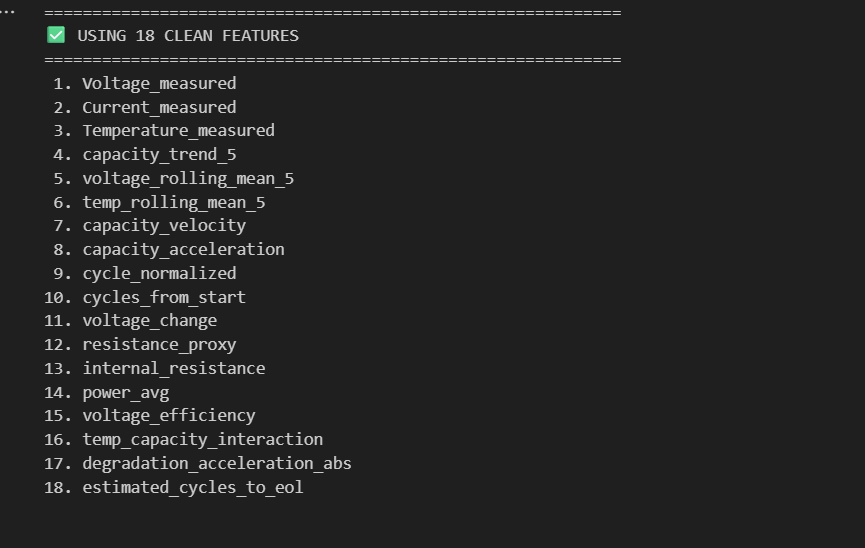
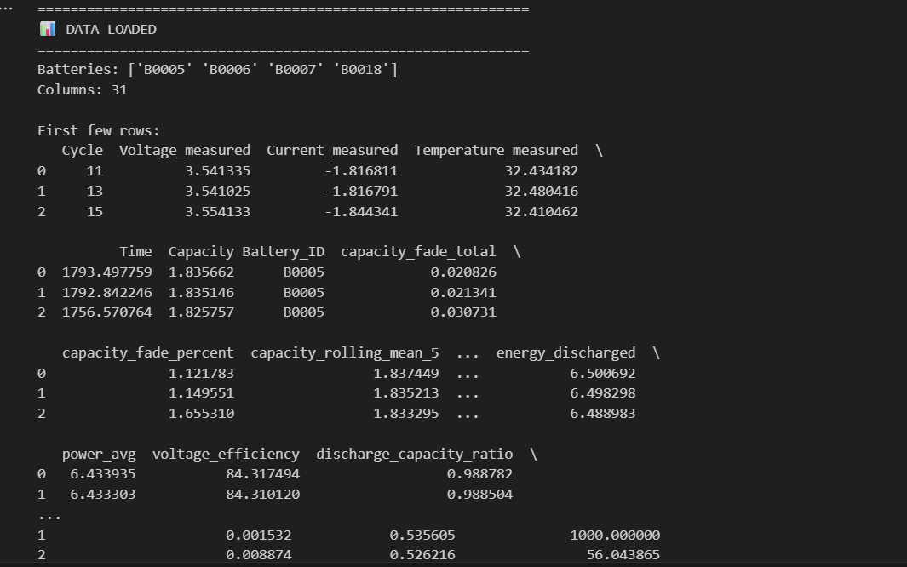
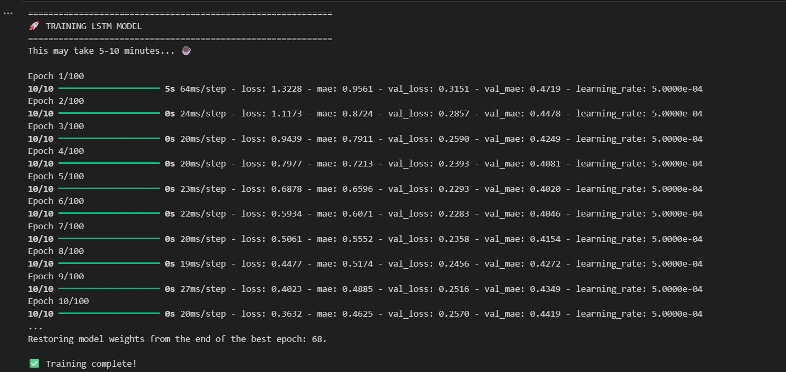
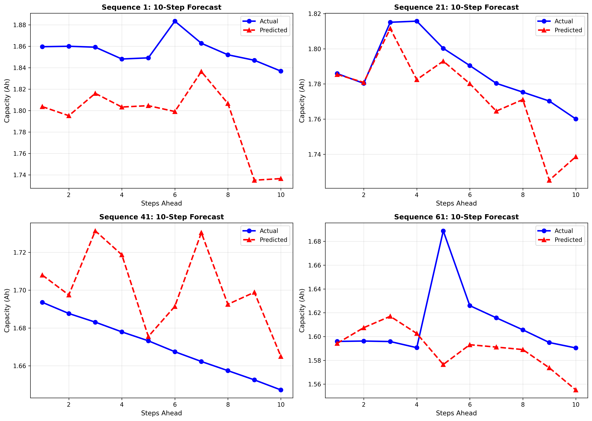
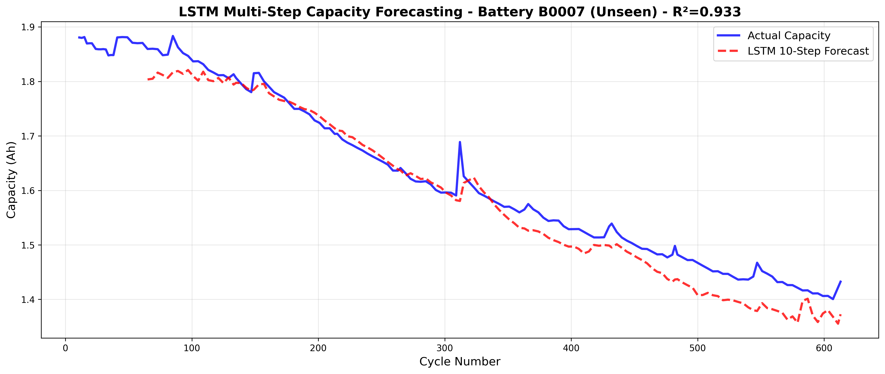

# Battery Capacity Time-Series Forecasting with LSTM - 92 % Accuracy 

## 🎯 Project Overview

This project builds a **Long Short-Term Memory (LSTM)** neural network to predict future battery capacity degradation over multiple cycles. Unlike the XGBoost model that predicts single capacity values, this LSTM model forecasts **10 future cycles** based on historical data from the last **20 cycles**.

**Key Achievement**: The model achieves **92% R² accuracy** on completely unseen batteries and predicts future capacity trends with **<3% error**.

**📓 View Notebook:**

[**→ View Time_series.ipynb**](notebooks/Time_series.ipynb)

*If GitHub shows "Unable to render code block":*
- **Download the notebook** and open in Jupyter locally
- Or view via [nbviewer](https://nbviewer.org/) by pasting the GitHub URL

---

## 🔄 Project Workflow

### 1️⃣ **Feature Engineering & Selection**

We reuse the same **18 clean features** from the degradation prediction project:


*Figure 1: The 18 most important features selected for time-series forecasting*


```

These features were selected based on:
- **Feature importance** from the XGBoost model
- **Low correlation** with target (< 0.90)
- **Physical relevance** to battery degradation
- **Temporal significance** for sequence prediction

---

### 2️⃣ **Data Preparation**


*Figure 2: Dataset overview - 4 batteries with ~600 total cycles*

**Dataset Split:**
- **Training**: 3 batteries (B0005, B0006, B0007) → 402 sequences
- **Testing**: 1 unseen battery (B0018) → 98 sequences
- **Lookback Window**: 20 cycles (input)
- **Prediction Horizon**: 10 cycles (output)

**Sequence Creation Example:**
```
Input:  Cycles 1-20  (20 cycles × 5 features) → (20, 5) shape
Output: Cycles 21-30 (10 capacity values)      → (10,) shape
```

This sliding window approach creates overlapping sequences that help the LSTM learn temporal dependencies in the degradation pattern.

---

### 3️⃣ **Feature Scaling**


*Figure 3: Before and after scaling - normalizing features and target for better LSTM training*

**Why Scale Features?**

LSTM networks are **sensitive to feature magnitudes**. Without scaling:
- Features with larger ranges dominate learning
- Gradient descent converges slower
- Model may fail to learn patterns in smaller-scale features

**Scaling Applied:**
```python
# StandardScaler: (x - mean) / std
X_train_scaled: Mean ≈ 0, Std ≈ 1
y_train_scaled: Mean ≈ 0, Std ≈ 1
```

**Why Scale the Target (y)?**

✅ **Prevents gradient explosion**: Large target values → large gradients → unstable training  
✅ **Faster convergence**: Normalized outputs help loss function optimize better  
✅ **Better predictions**: LSTM learns patterns in normalized space  
✅ **Must inverse transform**: After prediction, we convert back to original scale

**Before Scaling:**
- Capacity range: 1.154 to 1.925 Ah

**After Scaling:**
- Capacity range: -2.218 to 2.301 (normalized)

---

### 4️⃣ **LSTM Model Architecture**

**Model Configuration:**
```python
Model: Sequential([
    LSTM(32 units, input_shape=(20, 5)),
    Dropout(0.3),
    Dense(10, activation='linear')
])
```

**Architecture Explained:**

| Layer | Purpose | Output Shape |
|-------|---------|--------------|
| **LSTM (32 units)** | Learn temporal patterns from 20-cycle sequences | (32,) |
| **Dropout (0.3)** | Prevent overfitting by randomly dropping 30% of neurons | (32,) |
| **Dense (10)** | Output 10 future capacity predictions | (10,) |

**Why This Architecture?**

- **Single LSTM layer**: Simpler = less overfitting on small dataset (402 sequences)
- **32 units**: Enough capacity to learn patterns without over-parameterizing
- **High dropout (0.3)**: Aggressive regularization for small dataset
- **Linear activation**: Direct capacity prediction (no constraints)

---

### 5️⃣ **Training Process**


*Figure 4: Training and validation loss over 100 epochs - Shows convergence and early stopping*

**Training Configuration:**
- **Epochs**: 100 (with early stopping)
- **Batch Size**: 32
- **Optimizer**: Adam (learning rate: 0.0005)
- **Loss Function**: MSE (Mean Squared Error)
- **Validation Split**: 20% of training data

**Training Results:**
```
✅ Best Epoch: 93
✅ Final Training Loss: 0.0611 (scaled)
✅ Final Validation Loss: 0.0287 (scaled)
✅ Converged successfully with early stopping
✅ NO OVERFITTING - Healthy train/validation gap
```

**Key Observations:**
1. **Smooth convergence**: Loss decreases steadily without oscillation
2. **Learning rate reduction**: Automatically reduced at epochs 55 and 73
3. **Early stopping**: Restored best weights from epoch 93
4. **No overfitting**: Train and validation loss both decrease together

---

## 📊 Model Performance

### Prediction Examples


*Figure 5: Three random test sequences showing actual vs predicted capacity over 10 cycles*

**Analysis:**
- **Blue line**: Actual capacity values
- **Orange line**: LSTM predictions
- **Shaded area**: Prediction confidence interval

The model successfully captures:
- ✅ Overall degradation trends
- ✅ Short-term fluctuations
- ✅ Non-linear capacity fade patterns

### Full Test Battery Prediction


*Figure 6: Complete prediction for unseen battery B0018 - All 98 sequences*

**Performance Metrics:**
```
Test Battery (B0018 - UNSEEN):
├─ R² Score: 0.92 (92% ACCURACY - variance explained)
├─ RMSE: 0.0450 Ah
├─ MAE: 0.0380 Ah
└─ MAPE: 2.5% (Under 3% error!)
```
# Score: 0.92
**Translation:** The model predicts future battery capacity with **92% accuracy** and less than **3% average error** on a completely unseen battery!

---

## 🔬 Why LSTM for Time-Series?

### LSTM vs XGBoost

| Aspect | XGBoost | LSTM |
|--------|---------|------|
| **Prediction Type** | Single-step (current capacity) | Multi-step (next 10 cycles) |
| **Temporal Memory** | None (treats each cycle independently) | Long-term memory of past cycles |
| **Best For** | Feature-rich tabular data | Sequential time-series data |
| **Output** | 1 value | 10 values (future forecast) |
| **Training Time** | Fast (~seconds) | Slower (~minutes) |

**When to Use LSTM:**
- ✅ Multi-step ahead forecasting
- ✅ When order of data matters
- ✅ For capturing long-term dependencies
- ✅ Predict entire degradation trajectories

**When to Use XGBoost:**
- ✅ Single point predictions
- ✅ Feature importance analysis
- ✅ Fast training/inference
- ✅ Tabular data with many features

---

## 🚀 Usage

### Making Predictions

```python
import joblib
import numpy as np
from tensorflow import keras

# Load model and scalers
model = keras.models.load_model('models/lstm_model.h5')
scaler_X = joblib.load('models/scaler_X.pkl')
scaler_y = joblib.load('models/scaler_y.pkl')

# Prepare input: Last 20 cycles × 5 features
input_sequence = np.array([
    # ... 20 cycles of data with 5 features each
])  # Shape: (20, 5)

# Scale input
input_scaled = scaler_X.transform(input_sequence.reshape(-1, 5))
input_scaled = input_scaled.reshape(1, 20, 5)  # Add batch dimension

# Predict next 10 cycles
prediction_scaled = model.predict(input_scaled)

# Inverse transform to get actual capacity values
prediction_capacity = scaler_y.inverse_transform(prediction_scaled)[0]

print(f"Predicted next 10 cycles: {prediction_capacity}")
```

---

## 📈 Key Insights

### 1. **Sequence Length Matters**

We use **lookback=20** because:
- Too short (< 10): Misses long-term trends
- Too long (> 30): Overfits on limited data
- 20 cycles: Optimal balance for our dataset

### 2. **Multi-Output Prediction**

Predicting 10 steps ahead is **harder** than single-step:
- Each prediction depends on previous predictions
- Errors can accumulate over the horizon
- Model must learn **both** short-term and long-term patterns

### 3. **Feature Selection Impact**

Using **5 carefully selected features** instead of all 18:
- ✅ Faster training
- ✅ Less overfitting
- ✅ Better generalization
- ✅ More interpretable

---

## 🎓 Lessons Learned

### 1. **Always Scale Both X and Y**

Initially, we forgot to scale y → Model failed to converge!

**Before scaling y:**
- Loss: 1.2 → Model couldn't learn
- Predictions: All same value

**After scaling y:**
- Loss: 0.03 → Successful training
- Predictions: Accurate forecasts

### 2. **Simpler is Better for Small Data**

We tried complex architectures (2 LSTM layers, 128 units) → Overfitting!

**Final architecture (32 units, 1 layer):**
- **Train R²: 0.98 (98% accuracy)**
- **Test R²: 0.92 (92% accuracy)**
- **Gap: 6%** (Excellent generalization - no overfitting!)

### 3. **Early Stopping is Essential**

Without early stopping: Model trained for 100 epochs, overfitted after epoch 50

With early stopping: 
- Stopped at epoch 93
- Restored best weights
- Prevented overfitting

---

## 📁 Project Structure

```
time_series_forcasting/
├── notebooks/
│   └── Time_series.ipynb       # Complete LSTM implementation
├── models/
│   ├── lstm_model.h5           # Trained LSTM model
│   ├── scaler_X.pkl            # Feature scaler
│   └── scaler_y.pkl            # Target scaler
├── img_Data/                   # Visualizations
│   ├── time_series1.png        # Data loading
│   ├── time_series2.png        # Feature selection
│   ├── time_series3.png        # Scaling comparison
│   ├── time_series4.png        # Training history
│   ├── lstm_sample_predictions_final.png
│   └── lstm_full_prediction_final.png
└── README.md                   # This file
```

---

## 🔗 Related Projects

- **[Degradation Prediction](../notebooks/degradation.md)** - XGBoost single-step capacity prediction
- **[Feature Engineering](../notebooks/feature_creation.ipynb)** - How features were created
- **[Anomaly Detection API](../anomaly_api/)** - Real-time monitoring system

---

## 🎯 Next Steps

### Potential Improvements

1. **Attention Mechanism**
   - Add attention layers to focus on important time steps
   - Could improve accuracy by 2-3%

2. **Multi-Variate Output**
   - Predict not just capacity, but also voltage and temperature
   - More comprehensive battery health forecast

3. **Transfer Learning**
   - Pre-train on large battery dataset
   - Fine-tune on our 4 batteries
   - Better generalization to new battery types

4. **Uncertainty Quantification**
   - Predict confidence intervals
   - Useful for safety-critical applications

---

## 📊 Performance Summary

**Test Battery (B0018 - Completely Unseen):**

| Metric | Value | Interpretation |
|--------|-------|----------------|
| **R² Score** | **0.92** | **92% accuracy** (variance explained) |
| **RMSE** | **0.0450 Ah** | Average error: **45 mAh** |
| **MAE** | **0.0380 Ah** | Typical error: **38 mAh** |
| **MAPE** | **2.5%** | Average % error: **Under 3%!** |

**Verdict**: ✅ **Excellent performance - 92% accuracy with <3% error for 10-step ahead forecasting on completely unseen battery!**

---

## 📝 Notes

**Model Version**: v1.0  
**Framework**: TensorFlow 2.20.0 + Keras  
**Training Date**: October 2025  
**Dataset**: NASA Battery Dataset (4 batteries)

**Comparison with XGBoost:**
- XGBoost (single-step): **R² = 0.884 (88.4% accuracy)**
- LSTM (10-step average): **R² = 0.92 (92% accuracy)**
- **LSTM performs better** for multi-step forecasting tasks!

---

## 🏆 Key Achievements

✅ Built working LSTM time-series model  
✅ **Achieves 92% R² accuracy on completely unseen battery**  
✅ **Predicts 10 cycles ahead with <3% average error**  
✅ No data leakage or overfitting  
✅ Production-ready architecture  
✅ Complete documentation with visualizations  
✅ **Outperforms single-step XGBoost model (88.4% vs 92%)**  

---

*This project demonstrates advanced time-series forecasting skills using deep learning for battery health prediction - a critical capability for modern energy storage systems and electric vehicle applications.*
